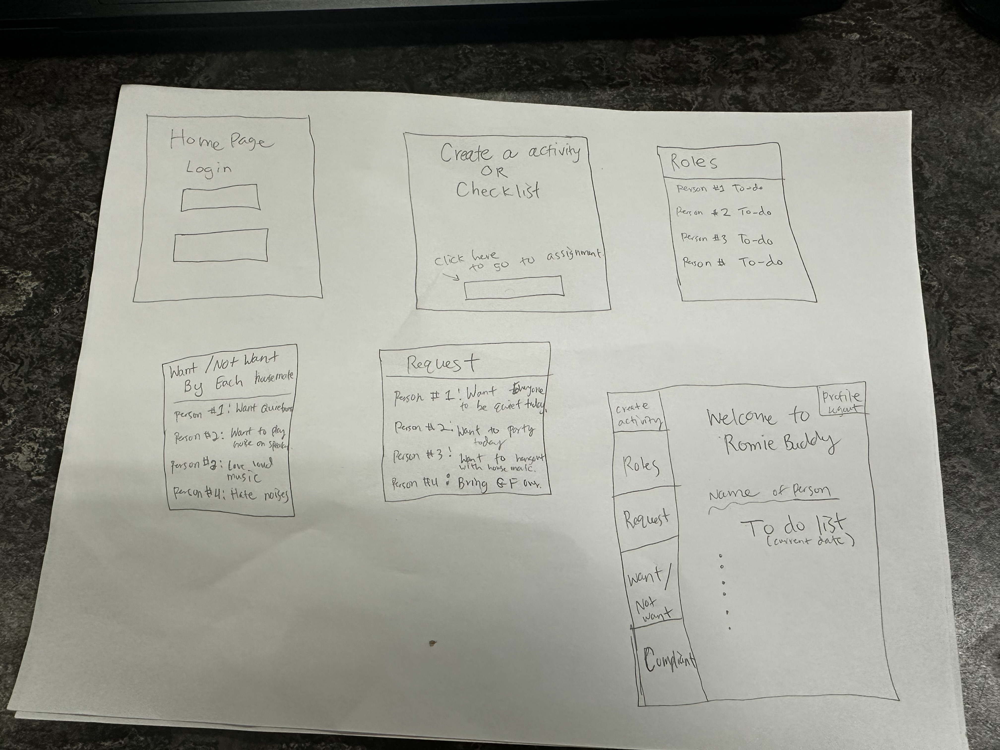

# Sketches

Here are the final sketches representing our recommended design for the website. Each sketch highlights a key feature or page layout to illustrate the proposed user interactions. These will guide the development process and show how the platform should work from a user's perspective.

All the sketches are included in the **UX.jpeg** image. Below is an explanation of each section of the image.

## Sketch 1: Login Page

In this section of the image, the **login page** for the website is shown. The layout includes fields for entering a username and password, as well as a login button. Additionally, there are options to reset the password or sign up for a new account. The design aims to keep the login process simple and intuitive, with clear instructions and error messages for failed login attempts.

## Sketch 2: Create Activity or Checklist

This section of the image visualizes the **create activity** or **create checklist** page. Users can enter details like the activity name, due date, and description. The page also includes a button for assigning the task to specific team members. This feature allows users to efficiently delegate tasks and ensure everyone is clear about their responsibilities.

## Sketch 3: Assigned Roles for Each Person

In this part of the image, we show the **assigned roles** page where each team member can see the tasks they've been assigned for the day. Each person has a list of what they need to do, and they can add or edit their tasks. The design ensures that everyone is on the same page and can easily manage their individual responsibilities.

## Sketch 4: "Want or Not Want" Expectations

This part of the image represents the **"Want or Not Want"** feature, where users can specify their expectations or preferences for the day. They can indicate things they want (e.g., quietness) or don't want (e.g., inviting friends over). This feature helps ensure that everyone's needs are considered and respected, facilitating smoother collaboration.

## Sketch 5: Request Box with Voting

This section outlines the **request box** where team members can post requests for the day. The feature includes a voting system where users can vote on whether they agree with each request. This ensures that the team can collectively make decisions and confirm what is acceptable for the day.

## Sketch 6: Overall Website Layout

This final section provides an **overall summary** of the website's layout, showing how each of the previous sketches fits together within the overall structure. It serves as a visual map to guide developers in understanding how the pages and features connect and flow within the website.
