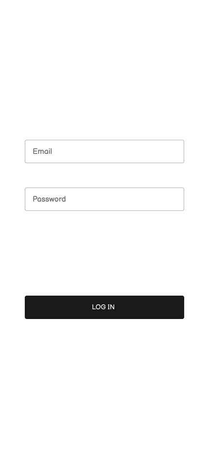
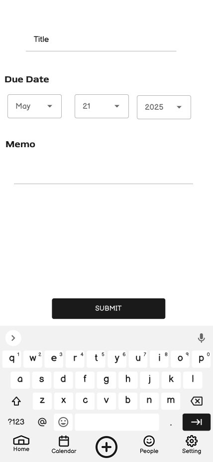
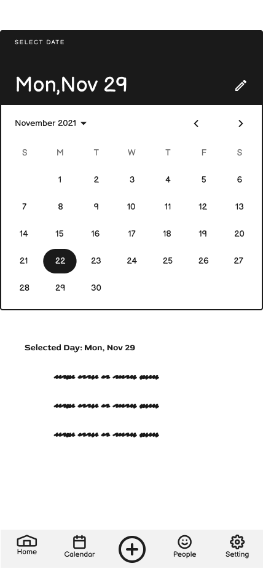

# Wireframes

This section includes high-level wireframes for the RoomieBuddy mobile app prototype. These frames represent the main user flows and were designed to support key tasks identified through usability testing and user research.

Each wireframe is explained below in the context of a common user scenario to show how RoomieBuddy enables smooth, intuitive roommate coordination.

---

## Sign In Page

**Purpose:**  
Serves as the entry point into the app. Users log in with existing credentials or proceed to sign up. This screen lays the groundwork for personalized task and calendar content tied to specific user accounts.

---

## Home Page

**Purpose:**  
After signing in, users land on the home page. This screen provides a summarized view of their assigned chores, upcoming events, and roommate activity. It functions as the hub for navigation to tasks, calendar, and messaging features.

---

## Task Add Page

**Purpose:**  
Enables users to assign new chores to themselves or roommates. Users can input task details, select priority levels, set deadlines, and designate task ownership. Supports the main user story: *“Assign a chore to Alex for Friday.”*

---

## Calendar Page

**Purpose:**  
Displays shared household events and chore schedules in a weekly view. Users can quickly visualize deadlines and overlaps. Helps users complete tasks like checking urgent priorities or planning around roommates' availability.

---

## Settings Page

**Purpose:**  
Allows users to customize app behavior, manage notifications, link accounts, and adjust shared responsibilities. Includes preferences for reminders, calendar integrations, and roommate permissions.

---

## Scenario Walkthrough: Assigning and Managing a Chore

1. **Sign In Page** – User logs into RoomieBuddy.
2. **Home Page** – From the dashboard, the user reviews tasks and chooses to add a new one.
3. **Task Add Page** – The user enters task details ("Take out trash"), assigns it to Alex, and sets the due date for Friday.
4. **Calendar Page** – The user confirms the task is now visible on the shared weekly view.
5. **Settings Page** – (Optional) User adjusts notification preferences to get a reminder the day before.

---

## Design Insights & Iterations

User feedback during usability testing led to refinements in button labeling and icon clarity—particularly on the Calendar and Task Add pages. Users expressed confusion around some priority indicators, which has been addressed with simplified visual cues. These findings reinforced the need for an intuitive visual language across all wireframes.

If any future iterations modify personas or scenarios, those updates will be reflected in the documentation accordingly.

---
