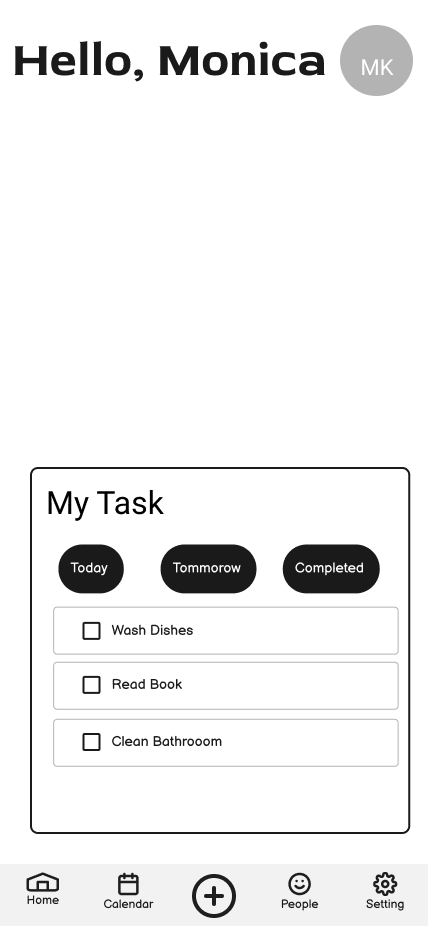
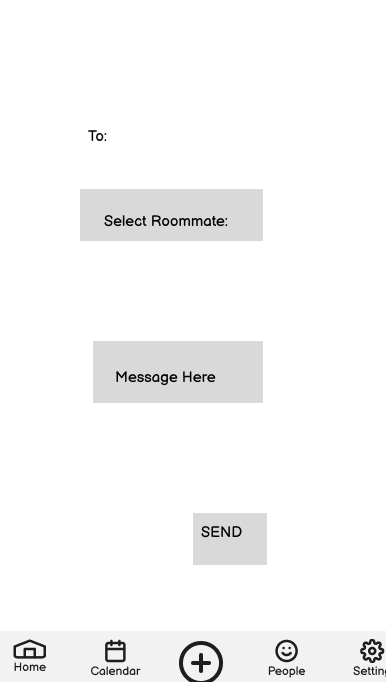
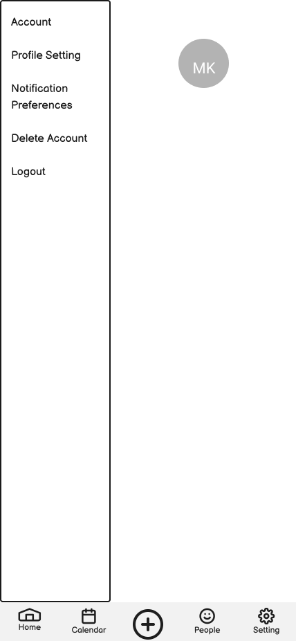

# Wireframes

This section includes high-level wireframes for the RoomieBuddy mobile app prototype. These frames represent the main user flows and were designed to support key tasks identified through usability testing and user research.

Each wireframe is explained below in the context of a common user scenario to show how RoomieBuddy enables smooth, intuitive roommate coordination.

---

## Sign In Page

**Purpose:**  
Serves as the entry point into the app. Users log in with existing credentials or proceed to sign up. 

---

## Home Page

**Purpose:**  
After signing in, users land on the home page. This screen provides a summarized view of their assigned chores, upcoming events, and roommate activity. It functions as the hub for navigation to tasks.

---

## Request Page

**Purpose:**
Once the "+" is clicked, the user will go to the request page where they can send a request to a specific roommates or all. Then once they click send, they will be transferred to the Task Add Page.

---

## Task Add Page

**Purpose:**  
Enables users to put a "name" or "purpose" of their request and selection of the date they wanted to begin to end. 

---

## Calendar Page

**Purpose:**  
Displays shared household events and chore schedules in a weekly view. Users can quickly visualize deadlines and overlaps. Helps users complete tasks like checking urgent priorities or planning around roommates' availability.

---

## Settings Page

**Purpose:**  
Allows users to customize app behavior, manage notifications, link accounts, and adjust shared responsibilities. Includes preferences for reminders, calendar integrations, and roommate permissions.

---

## Scenario Walkthrough: Assigning and Managing a Chore

1. **Sign In Page** – User logs into RoomieBuddy.
2. **Home Page** – From the dashboard, the user reviews tasks.
3. **Request Page** - User will request anything by using the "+" button.
4. **Task Add Page** – The user enters task details ("Take out trash"), assigns it to Alex, and sets the due date for Friday.
5. **Calendar Page** – The user confirms the task is now visible on the shared weekly view.
6. **Settings Page** –  User adjusts notification preferences to get a reminder the day before.

